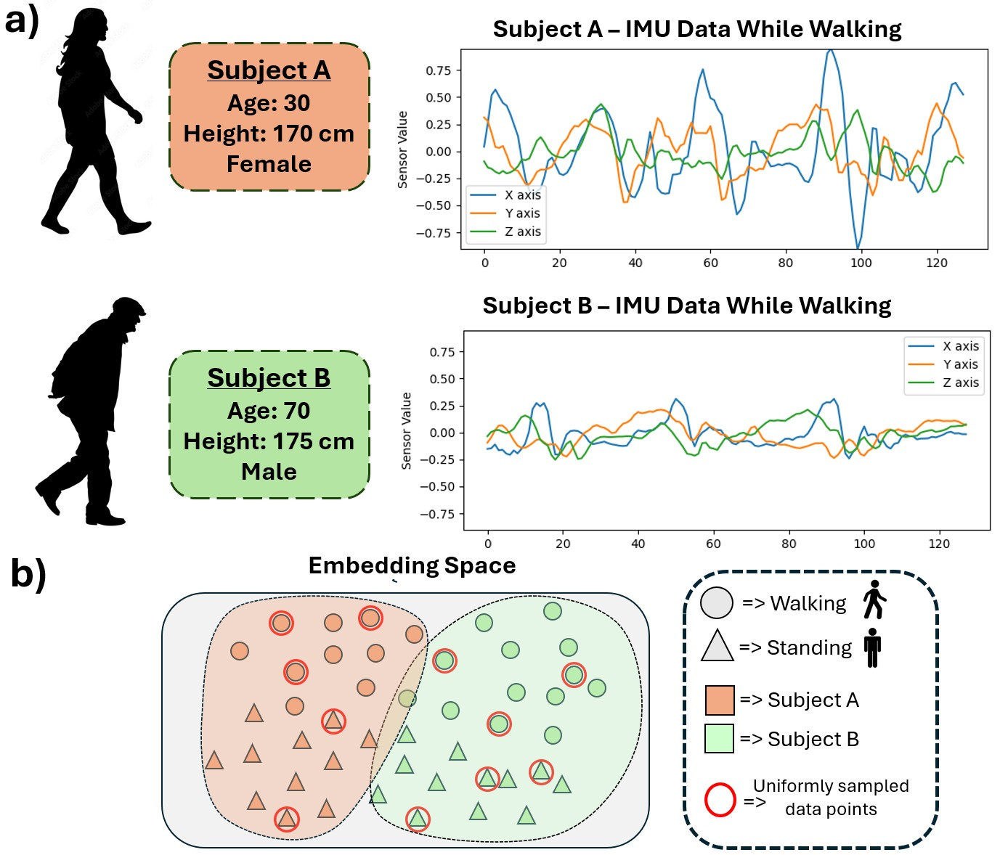

# Subject Invariant Contrastive Learning for Human Activity Recognition 


Code for Subject Invariant Contrastive Learning for Human Activity Recognition published at MLSP 2025.

**ArXiv:** [Subject Invariant Contrastive Learning for Human Activity Recognition](https://arxiv.org/abs/2507.03250)

Y. Yarici, K. Kokilepersaud, M. Prabhushankar, and G. Alregib, "Subject Invariant Contrastive Learning for Human Activity Recognition" in 2025 IEEE 35th International Workshop on Machine Learning for Signal Processing (MLSP), Istanbul, Turkey 2025.

## Abstract

The high cost of annotating data makes self-supervised approaches, such as contrastive learning methods, appealing for Human Activity Recognition (HAR). Effective contrastive learning relies on selecting informative positive and negative samples. However, HAR sensor signals are subject to significant domain shifts caused by subject variability. These domain shifts hinder model generalization to unseen subjects by embedding subject-specific variations rather than activity-specific features. As a result, human activity recognition models trained with contrastive learning often struggle to generalize to new subjects. We introduce Subject-Invariant Contrastive Learning (SICL), a simple yet effective loss function to improve generalization in human activity recognition. SICL re-weights negative pairs drawn from the same subject to suppress subject-specific cues and emphasize activity-specific information. We evaluate our loss function on three public benchmarks: UTD-MHAD, MMAct, and DARai. We show that SICL improves performance by up to 11% over traditional contrastive learning methods. Additionally, we demonstrate the adaptability of our loss function across various settings, including multiple self-supervised methods, multimodal scenarios, and supervised learning frameworks.

## Method Overview


*This figure demonstrates the variations in activity patterns captured from different subjects. a) Although both samples belong to the same walking activity, the data from adult Subject A shows considerably greater variation compared to the data from older Subject B due to inherent subject variability in human activity data. b) The data from two different subjects show distributional shifts in the embedding space. Traditional methods sample these points uniformly without considering distributional shifts. Our loss function considers these distributional shifts to learn subject-invariant features.*


## Usage


### Datasets

The datasets that are currently supported, and their included modalities, are as follows:
* UTD-MHAD: inertial, skeleton
* MMAct: inertial, skeleton
* DARai: inertial, foot pressure

Before you can run the training scripts, you must download the datasets and generate the expected folder structure.

Our intention is for all the supported datasets to be compatible with the provided models. Training a model on a different dataset should only require changing one experiment parameter and, optionally, other model/transform hyperparameters. In order to be able to do this, we provide "raw preprocessing" code which transforms the data for each dataset and saves it into a common, uniform format.

The common format for all data is inspired by the original format of UTD-MHAD: each modality is present in a separate folder, and each sample is one file/subdirectory of that folder.

### Data Preparation

For downloading and preparing UTD-MHAD and MMAct refer to [CMC-CMKM](https://github.com/razzu/cmc-cmkm) repository.

For DARai dataset download instructions and preparation refer to the [DARai](https://github.com/olivesgatech/DARai/tree/main/timeseries_Activity_Recognition) repository.


### Training

**SimCLR Baseline Training:**

```bash
python -m ssl_training \
  --dataset utd_mhad \
  --data_path ./data/utd_mhad \
  --model transformer \
  --experiment_config_path configs/simclr/inertial_simclr_utd.yaml \
  --framework simclr \
  --augmentations_path configs/inertial_augmentations/augmentations_utd.yaml
```

**SICL Training:**

```bash
python -m ssl_training \
  --dataset utd_mhad \
  --data_path ./data/utd_mhad \
  --model transformer \
  --experiment_config_path configs/simclr/inertial_simclr_utd.yaml \
  --framework SICL \
  --augmentations_path configs/inertial_augmentations/augmentations_utd.yaml
```

For training with other datasets and frameworks refer to the `run.txt` file.


## Ciation 

Y. Yarici, K. Kokilepersaud, M. Prabhushankar, and G. Alregib, ”Subject Invariant Contrastive Learning for Human Activity Recognition” in 2025 IEEE 35th International Workshop on Machine Learning for Signal Processing (MLSP), Istanbul, Turkey 2025.


```
    @inproceedings{yarici2025subject,
    title={Subject Invariant Contrastive Learning for Human Activity Recognition},
    author={Yarici, Yavuz and Kokilepersaud, Kiran and Prabhushankar, Mohit and AlRegib,Ghassan},
    booktitle={2025 IEEE 35th International Workshop on Machine Learning for Signal Processing (MLSP)},
    address={Istanbul, Turkey}
    ,
    publisher=
    {IEEE
    }
    ,
    year=
    {2025}}
```

### Code Acknowledgments

The code is adopted from origial code repository of CMM-CMKM paper : https://github.com/razzu/cmc-cmkm

We use [solo learn ](https://github.com/vturrisi/solo-learn)library for Barlow Twins and VicReg methods


